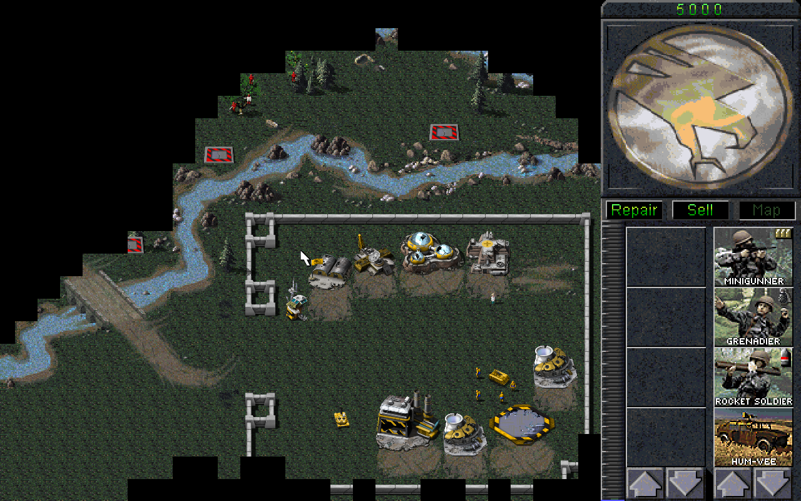
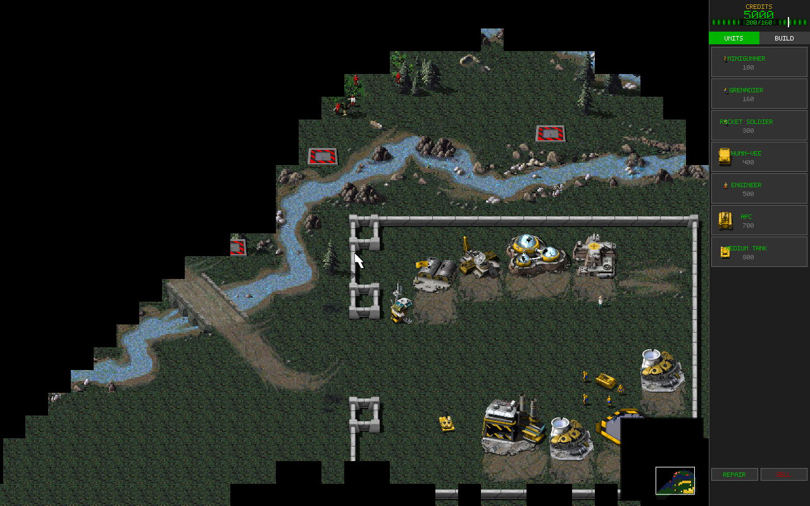
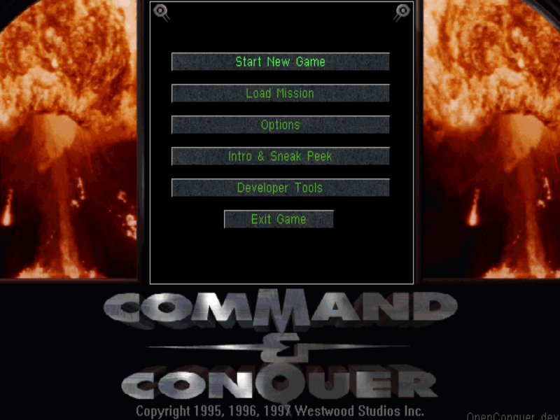
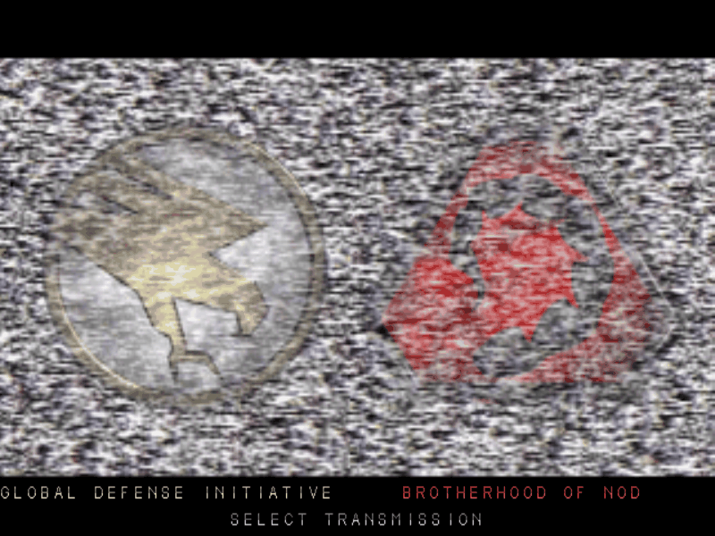
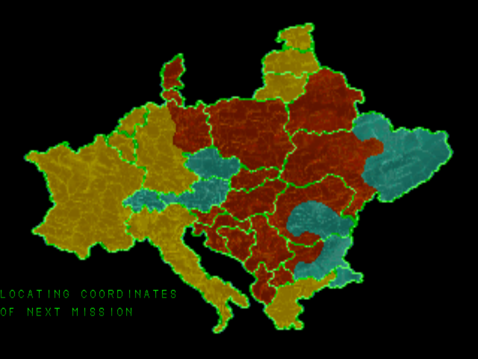
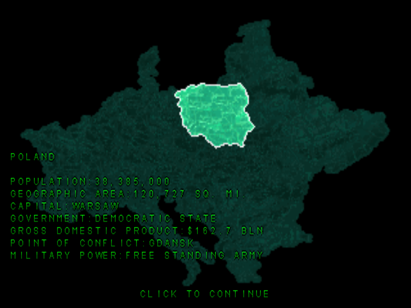
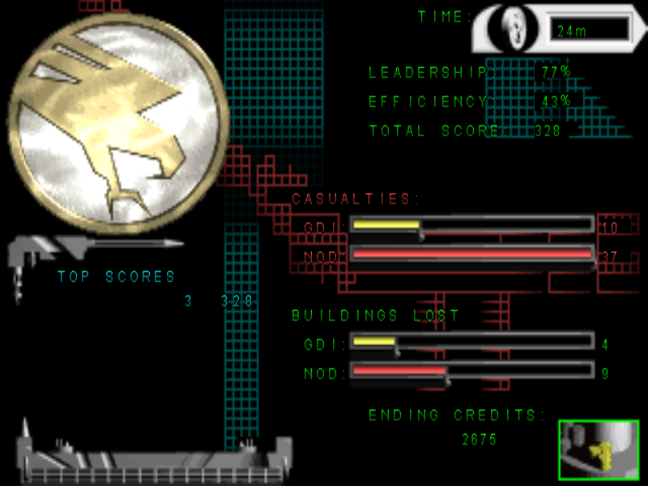
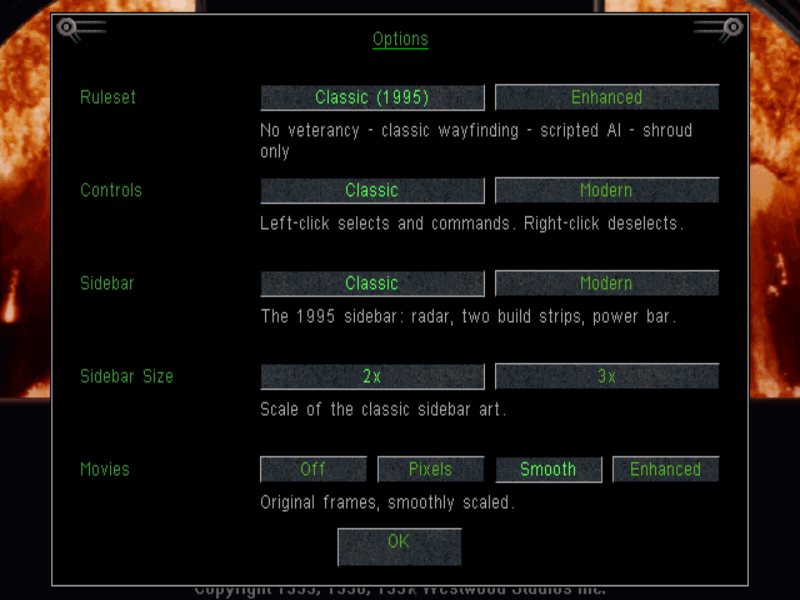

# OpenConquer

**A native macOS reimplementation of the classic 1995 Westwood real-time strategy game *Command & Conquer: Tiberian Dawn*, written in Swift + SDL2.**

> ⚠️ **Unofficial fan project.** OpenConquer is not affiliated with, endorsed by, or sponsored by Electronic Arts. "Command & Conquer" and "Tiberian Dawn" are trademarks of Electronic Arts Inc. **No game assets are included.** You must own the [Command & Conquer Remastered Collection](https://www.ea.com/games/command-and-conquer/command-and-conquer-remastered) and supply your own assets (see [Assets](#assets)).

---

## Screenshots

*Illustrative captures of OpenConquer running on a locally installed copy of the game data — no game data is distributed with the project. How each was made: [`docs/screenshots/README.md`](docs/screenshots/README.md).*


*A GDI base (mission 12) with the classic sidebar, Remastered HD sprites.*


*The same base with the modern sidebar and its HD power and build meters.*

| | |
|---|---|
|  |  |
| *The Win95 title screen and main menu, with our Options and Developer Tools in the classic style.* | *Choose your side, as in 1995.* |
|  |  |
| *The animated map selection between missions.* | *The chosen country's statistics.* |
|  |  |
| *The end-of-mission score screen.* | *Our settings in the classic dialog style.* |

---

## Why this exists

There is no polished, native, *faithful* way to play the original Tiberian Dawn on a Mac:

- The **C&C Remastered Collection** is Windows-only (runs on Mac only via Wine/CrossOver/Parallels).
- **OpenRA** is native and excellent, but deliberately *reinterprets* the game on a modernized engine — it isn't original parity.
- **Vanilla-Conquer** (EA's GPL source, faithful) builds on Mac but is a niche, build-it-yourself experience.

OpenConquer aims at the empty square: **native Mac · faithful simulation · modern presentation · fully moddable.**

Design principle: **faithful simulation, modern presentation, data-driven.**
- *Faithful simulation* — mechanics and behaviors match the original where it counts (cross-checked against EA's released C++).
- *Modern presentation* — arbitrary window size, smooth zoom, and optional HD art from the Remastered Collection.
- *Data-driven* — units, rules, and missions live in data, so the game is configurable (classic vs. enhanced rulesets) and moddable.

See [`docs/VISION.md`](docs/VISION.md) and [`docs/ROADMAP.md`](docs/ROADMAP.md).

## Status

Early but very playable: GDI and Nod campaign missions, AI, pathfinding, fog of war, economy/harvesting, combat, superweapons, save/load, and both classic-SHP and remastered-HD rendering.

The campaign plays start to finish with the original's presentation, ported from EA's released source:

- **Front end** — the Westwood logo, the Win95 title screen and main menu, and choose-your-side, with the classic Load Mission and Options dialogs.
- **Movies** — the original cutscenes before and after each mission, decoded from your own `MOVIES.MIX`. An optional *Enhanced* mode upscales them live with Apple's low-latency super-resolution (macOS 26+).
- **Between missions** — the end-of-mission score screen with its hall of fame, and the animated map selection where you pick the next territory.
- **Endings** — both campaign endings, including Nod's satellite target selection.
- **In the game** — construction animations for placed and deployed buildings, the original's build-list rules on the sidebar, the classic 1995 sidebar or a modern one with the Remastered HD meters, and the original repair wrench.

Expect rough edges and missing features — see [`docs/PARITY.md`](docs/PARITY.md) for exactly what matches the original and what doesn't. This is a work in progress and contributions are welcome.

## Requirements

- **macOS 13+**
- **SDL2** — `brew install sdl2 pkg-config`
- **Swift toolchain** (Xcode or the swift.org toolchain; the package targets swift-tools 5.9)
- **The game data**: the C&C Remastered Collection (for the HD art), or EA's free 1995 GDI and Nod discs (see [Assets](#assets))

## Assets

OpenConquer ships **no game data** — it imports it from your own copy of the game.

### In the app (recommended)

Launch OpenConquer. With no game data yet, it opens the import screen, which lists the two things the game can use:

1. **The classic 1995 game data (required).** It comes from either of these sources:
   - **The [C&C Remastered Collection](https://store.steampowered.com/app/1213210/).** The app finds it in the usual places, including CrossOver and Whisky bottles and external drives.
   - **The original game's GDI and Nod discs.** EA made these free in 2007 and no longer hosts them, but fan sites such as [CnCNZ](https://cncnz.com/features/freeware-classic-command-conquer-games/) do. **Get Free Game** opens that page in your browser. The import screen watches your Downloads folder and picks up `GDI95.zip` and `NOD95.zip` (or the `.iso` inside) when they finish downloading. It also accepts a disc folder or image you choose or drag onto the window.
2. **The Remastered Collection's HD art and audio (optional).** This only comes from the Remastered Collection. If your copy is only partly downloaded, the screen names the missing files.

**Import** copies the classic archives and extracts the HD art and audio, which takes under a minute. To run it again later, choose **Developer Tools → Import Game Data** on the title screen.

Everything lands in the engine's data directory, the same one [Vanilla-Conquer](https://github.com/TheAssemblyArmada/Vanilla-Conquer) uses:
- the classic MIX archives in `~/Library/Application Support/Vanilla-Conquer/vanillatd/`;
- the extracted HD art and audio in `…/vanillatd/extracted/`.

### From a terminal (developers)

`install-assets.sh` does the same import from a Remastered Collection install with the original Python extractors:

```bash
pip3 install Pillow            # one-time: needed for HD sprite extraction
./install-assets.sh /path/to/CnCRemastered
./install-assets.sh --dry-run   # show exactly what it would do, run nothing
```

The app's own importer is the same code path as `--extract-assets` (see the headless harness below).

The classic archives go in the data directory as follows:
- **Shared archives from `CNCDATA/TIBERIAN_DAWN/CD1`, at its root:**
  - `UPDATEC.MIX` and `TEMPICNH`/`DESEICNH`/`WINTICNH.MIX`: the hi-res UI art and build cameos;
  - `CCLOCAL`/`UPDATE`/`UPDATA.MIX`: the Win95 fonts and title art;
  - `TRANSIT.MIX`: the choose-your-side screen.
- **Side-specific archives:** `GENERAL.MIX`, `SCORES.MIX` and `MOVIES.MIX` go in `gdi/` (from CD1) and `nod/` (from CD2).

## Build & run

```bash
brew install sdl2 pkg-config
swift build          # or: swift run
./TiberianDawnMax.command   # convenience wrapper (runs `swift run`)
```

### Build a double-clickable app

```bash
./tools/make-app.sh          # -> dist/OpenConquer.app
./tools/make-app.sh --dmg    # also dist/OpenConquer.dmg (drag-to-Applications)
./tools/make-app.sh --zip    # also dist/OpenConquer.zip
```

This packages the release binary as a real macOS `.app` — Dock icon, app name, no
terminal. It vendors the SDL dylibs into the bundle and rewrites their load paths,
so the result runs on a Mac **without Homebrew or a Swift toolchain installed**, then
smoke-tests the bundle before declaring success.

It still bundles **no game data** — assets stay in `~/Library/Application Support/`
where `install-assets.sh` puts them, and are read from there at runtime. Launch it
before extracting anything and you get a **setup screen** naming the path it checked
and the command to run; extract in another window, hit RETRY, and it picks them up
without a relaunch.

To keep assets somewhere else (an external drive, say):

```bash
defaults write org.openconquer.OpenConquer TDMax.dataDir /Volumes/Disk/cnc   # the .app
OPENCONQUER_DATA_DIR=/Volumes/Disk/cnc swift run                             # from a terminal
```

The environment variable is the convenient one from a terminal, but macOS does not pass
the environment to a Finder-launched app, so the bundle needs the `defaults` form.

`--dmg` produces the conventional drag-to-Applications disk image (~2.5 MB) instead of
a bare zip.

The release DMG on GitHub is signed with a Developer ID and notarized by Apple, so it
opens normally. A bundle you build yourself with `./tools/make-app.sh` (without
`--sign`) is ad-hoc signed only, so its first launch on someone else's Mac needs a
right-click → Open.

## Headless test harness

The simulation runs without a window/renderer/audio, which powers a deterministic regression suite (see [`CONTRIBUTING.md`](CONTRIBUTING.md)):

```bash
./.build/debug/TiberianDawnMax --determinism SCG01EA 2500   # 3 subprocess trials, assert identical
./.build/debug/TiberianDawnMax --headless    SCG01EA 600    # run + print a state digest
./.build/debug/TiberianDawnMax --test-crush   SCG01EA        # focused behavior self-tests
```

The seeded RNG makes runs bit-for-bit reproducible, so a change that perturbs the simulation shows up as a changed digest. **Please keep the determinism baselines green when changing simulation code.**

## Contributing

Contributions are very welcome — see [`CONTRIBUTING.md`](CONTRIBUTING.md). A lot of the roadmap is *data* work (rules, missions, unit tables) that doesn't require deep Swift knowledge. Never commit game assets.

[`docs/PARITY.md`](docs/PARITY.md) is the honest map of how close the simulation is to the original — what's verified, what's approximated, and what's missing. Several rows there are self-contained starting points.

## License

**GNU General Public License v3.0** — see [`LICENSE`](LICENSE).

OpenConquer builds on the behavior of the Tiberian Dawn game logic that Electronic Arts released under the GPLv3 in 2020, and cross-references [Vanilla-Conquer](https://github.com/TheAssemblyArmada/Vanilla-Conquer) (also GPLv3). Licensing OpenConquer under GPLv3 keeps it compatible with that lineage.

*Copyright © 2024–2026 David Clawson and contributors.*

## Credits & thanks

- **Electronic Arts** / **Westwood Studios** — the original game, and the 2020 GPLv3 source release that makes faithful reimplementation possible.
- **Vanilla-Conquer** and the **OpenRA** project — invaluable references and inspiration for the open-source C&C ecosystem.
